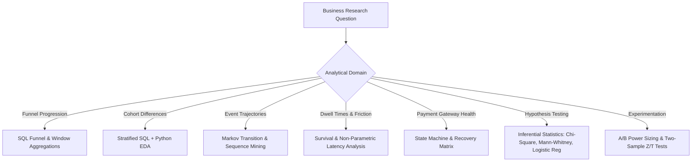

# Analytical Methods & Investigative Techniques

This document formally maps each core product research area to its designated analytical methodology, statistical test, and computational tooling.

---

## 1. Research Question to Analytical Method Mapping

| Research Domain | Specific Question / Metric | Analytical Method | Tools | Outputs / Deliverables |
| :--- | :--- | :--- | :--- | :--- |
| **Funnel Drop-Off** | Macro funnel milestone reach & drop-off rates | Step-based Funnel Analysis using SQL CTEs & Window Functions | SQL (PostgreSQL / DuckDB) | Funnel progression tables, drop-off waterfall bar charts |
| **Segment Variance** | Conversion variation by device, customer type, channel | Multi-way Stratified Cross-Tabulation & Breakdown Analysis | SQL + Python (Pandas) | Segment conversion comparison matrices |
| **Stage Dwell Times** | Hesitation latency at checkout steps | Dwell Time Profiling (Median, IQR, Violin Plots, Duration Histograms) | Python (Pandas, Seaborn) | Step duration distributions, lag vs. abandonment curves |
| **Payment Recovery** | Retry dynamics, method switching, final capture rate | Discrete State-Transition Modeling & Flow Matrix | SQL + Python | Payment recovery Sankey / transition probability matrix |
| **Commercial Friction** | Shipping ratio sensitivity, discount rejection impact | Binned Sensitivity Curves & Elasticity Analysis | Python (Pandas, Matplotlib) | Conversion vs. `shipping_ratio` response curves |
| **Path Trajectories** | Top converted vs. abandoned event paths | Sequential Event Path Mining & n-gram Frequency Analysis | Python (Pandas / collections) | Top 5 converting paths vs. top 5 abandonment paths |
| **Hypothesis Testing** | Validating H1–H10 statistical significance | Parametric & Non-Parametric Inferential Statistical Testing | Python (SciPy, Statsmodels) | p-values, test statistics, confidence intervals, effect sizes |
| **A/B Test Sizing** | Sample size, MDE, and experiment evaluation | Two-Sample Proportion Tests & Statistical Power Calculation | Python (Statsmodels) | Power curves, minimum sample requirements, decision scorecards |

---

## 2. Statistical Testing Standards

To maintain analytical rigor, statistical methods must be chosen strictly based on data distributions and measurement scales:

### 2.1 Categorical & Proportional Comparisons (e.g., Conversion Rates across Devices / Channels)
- **Primary Method:** Pearson's Chi-Square Test of Independence ($\chi^2$) or Two-Proportion Z-Test.
- **Assumptions Checked:** Expected cell frequency $\ge 5$ in all contingency cells.
- **Effect Size:** Cramér's V or Odds Ratio (OR).

### 2.2 Continuous & Latency Distributions (e.g., Dwell Time across Converted vs. Abandoned)
- **Primary Method:** Non-parametric **Mann-Whitney U Test** (Wilcoxon Rank-Sum) or **Kruskal-Wallis Test** across $>2$ groups.
- **Rationale:** Web latency and dwell times are strictly non-normal and heavily right-skewed; parametric t-tests on raw dwell time produce biased inferences.
- **Summary Metrics:** Median (p50), 25th percentile (p25), 75th percentile (p75), and Interquartile Range (IQR).

### 2.3 Multivariate Friction Modeling (Controlling for Confounders)
- **Primary Method:** **Binary Logistic Regression**:
  $$\operatorname{logit}(p) = \ln\left(\frac{p}{1-p}\right) = \beta_0 + \beta_1 X_{\text{device}} + \beta_2 X_{\text{customer\_type}} + \beta_3 X_{\text{shipping\_ratio}} + \beta_4 X_{\text{cart\_value}} + \epsilon$$
- **Purpose:** Disentangle whether mobile drop-off is driven by the device itself or by differences in traffic channel/cart size.
- **Reporting:** Adjusted Odds Ratios with 95% Confidence Intervals.

---

## 3. Machine Learning Policy
- **Policy:** Supervised machine learning (e.g., random forests, neural networks) is **not** required for standard funnel diagnostic analytics.
- **Justification:** Descriptive analytics, transition matrices, and inferential statistics provide direct, interpretable, and actionable answers to business stakeholders without black-box complexity. ML will only be explored if a specific complex predictive problem (e.g., dynamic personalized shipping thresholds) is introduced in advanced phases.
