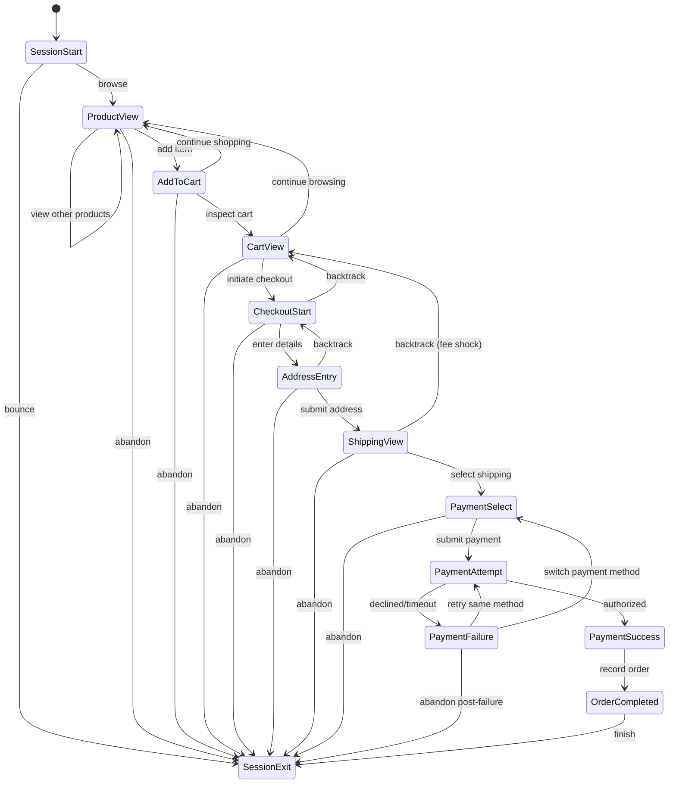

# Customer Journey & Event Taxonomy Specification

## 1. Journey Architecture Overview
The ShopSphere customer journey is modeled as a non-linear, stochastic state machine. While the standard intended conversion path flows from initial discovery to purchase confirmation, customers have full freedom to browse, backtrack, modify cart items, abandon at any step, experience payment errors, retry, or switch payment methods.

---

## 2. Event Taxonomy & Definitions

| Event Type | Stage | Repeatable? | Optional? | Terminal? | Description |
| :--- | :--- | :---: | :---: | :---: | :--- |
| `session_start` | Discovery | No | No | No | Initial landing event initializing session context and acquisition attributes. |
| `product_view` | Discovery / Browsing | Yes | No | No | Visitor views a specific product detail page (PDP). |
| `add_to_cart` | Cart Assembly | Yes | Yes | No | Visitor adds a product SKU and quantity to their active cart. |
| `cart_view` | Cart Assembly | Yes | Yes | No | Visitor views the shopping bag / cart drawer or cart page. |
| `promo_applied` | Cart / Checkout | Yes | Yes | No | Visitor attempts to apply a promotional coupon or discount code. |
| `checkout_start` | Checkout Initiation | Yes | Yes | No | Visitor clicks "Proceed to Checkout" and enters the checkout flow. |
| `address_entry` | Fulfillment Info | Yes | Yes | No | Visitor inputs shipping address, contact details, and recipient info. |
| `shipping_view` | Fulfillment Info | Yes | Yes | No | Visitor reviews calculated shipping fees, delivery dates, and carrier tiers. |
| `payment_select` | Payment Setup | Yes | Yes | No | Visitor selects payment instrument (Credit Card, Wallet, BNPL, NetBanking). |
| `payment_attempt` | Payment Execution | Yes | Yes | No | Transaction authorization request dispatched to the payment gateway. |
| `payment_failed` | Payment Execution | Yes | Yes | No | Gateway responds with error, bank decline, 3DS timeout, or insufficient funds. |
| `payment_success` | Payment Execution | No | Yes | No | Gateway successfully captures or authorizes the payment amount. |
| `order_completed` | Conversion | No | Yes | Yes* | Order confirmation screen rendered; purchase transaction finalized. |
| `session_exit` | Session Close | No | No | Yes | Customer closes tab, navigates away, or session times out (inactivity). |

*\*`order_completed` is the successful commercial terminal event; `session_exit` is the technical session termination event.*

---

## 3. Event Sequence Rules & Logical Dependencies

### 3.1 Logical Preconditions
- A `product_view` must precede an `add_to_cart` event.
- An `add_to_cart` event must occur before a `checkout_start` event.
- An `address_entry` typically precedes `shipping_view` because accurate shipping fees require a destination postal code.
- A `payment_attempt` requires a preceding `payment_select` and `shipping_view`.
- An `order_completed` event strictly requires a preceding `payment_success` within the same session.

### 3.2 Non-Linear & Permissible Behavioral Variations
- **Multi-Product Browsing:** A user may generate 1 to 20+ `product_view` events before an `add_to_cart` or session exit.
- **Cart Iterations:** A user may trigger multiple `add_to_cart` events, intermixed with `product_view` and `cart_view`.
- **Checkout Abandonment:** A user can abandon at any point in the flow (`address_entry`, `shipping_view`, `payment_select`) without reaching `payment_attempt`.
- **Backtracking:** A user at `shipping_view` may navigate back to `cart_view` (e.g., to adjust items after seeing shipping fees) and re-enter checkout.
- **Payment Retries:** A user encountering `payment_failed` may:
  1. Retry the exact same payment method (triggering another `payment_attempt`).
  2. Switch to a new payment method (triggering `payment_select` followed by `payment_attempt`).
  3. Exit the session without further attempts (failed checkout abandonment).

---

## 4. Journey States & Session Classification

Sessions will be categorized into standard behavioral states:

1. **Bouncer:** Session starts and ends with only 1 or 2 page views, no cart addition.
2. **Engaged Browser:** High volume of `product_view` events across categories, but no `add_to_cart`.
3. **Cart Abandoner:** Adds items to cart, may view cart, but never initiates checkout (`checkout_start`).
4. **Checkout Abandoner (Pre-Payment):** Initiates checkout, drops out at address entry or shipping review.
5. **Payment Drop-out:** Reaches payment stage, fails payment or abandons before authorization.
6. **Payment Recovered Purchaser:** Encounters payment failure, retries or switches method, and successfully completes purchase.
7. **Clean Purchaser:** Proceeds smoothly through the funnel with zero payment errors and completes purchase.

---

## 5. Temporal Attributes & Event Timestamps
Each event record captures:
- `event_timestamp`: Precise wall-clock timestamp (ISO 8601 / SQL Timestamp).
- `event_sequence`: 1-indexed strictly increasing integer representing event order within the session.
- `time_since_previous_event`: Duration (in seconds) elapsed since the immediately preceding event in that session (used to compute stage dwell times and hesitation latency).
