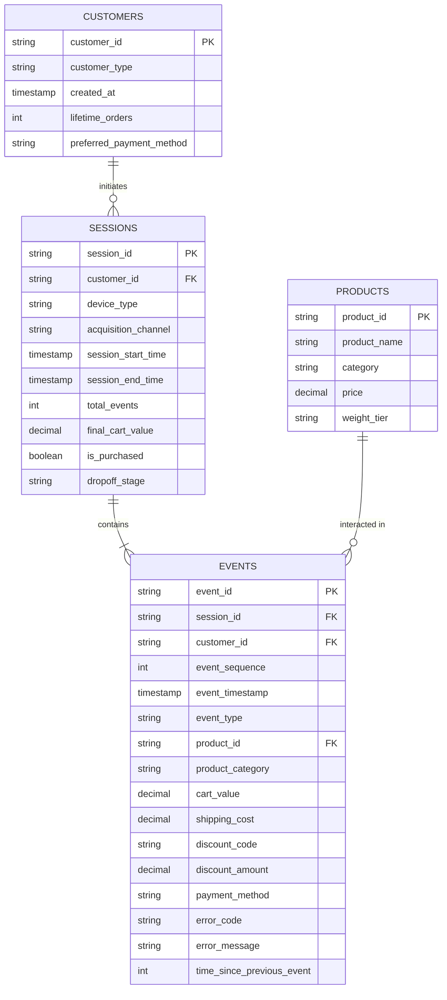

# Data Model & Schema Specification

## 1. Relational Architecture Overview
The ShopSphere analytics data model is designed as an event-driven star/snowflake schema optimized for product analytics, funnel drop-off diagnostics, and SQL window function queries.

The architecture comprises:
1. **`sessions` (Fact Table - Grain: 1 row per user session)**: Captures session-level rollup metrics, landing context, acquisition channel, device, customer segment, and final conversion state.
2. **`events` (Fact Table - Grain: 1 row per user action/event)**: Clickstream event stream containing fine-grained timestamps, event sequencing, stage states, cart values, shipping parameters, and error codes.
3. **`products` (Dimension Table - Grain: 1 row per product SKU)**: Product catalog attributes, category, price band, and typical shipping weight profile.
4. **`customers` (Dimension Table - Grain: 1 row per customer)**: Customer maturity attributes, registration date, lifetime orders, and default payment preference.

---

## 2. Table Schemas & Field Definitions

### 2.1 `sessions` Table
- **Purpose:** Stores high-level session metadata, channel attribution, device properties, and terminal status to allow rapid cohort filtering and top-of-funnel conversion analysis without full clickstream scanning.
- **Grain:** 1 record per unique browsing session.
- **Primary Key:** `session_id`
- **Foreign Keys:** `customer_id` → `customers.customer_id`

| Column Name | Data Type | Nullable | Description & Analytical Use |
| :--- | :--- | :---: | :--- |
| `session_id` | VARCHAR(64) | No | Unique identifier for the customer session (UUID). |
| `customer_id` | VARCHAR(64) | No | Unique customer identifier. |
| `customer_type` | VARCHAR(20) | No | `new` (first visit/guest) vs `returning` (repeat visitor). |
| `device_type` | VARCHAR(20) | No | Device category (`mobile`, `desktop`, `tablet`). |
| `browser` | VARCHAR(30) | Yes | Browser used (e.g., `Chrome`, `Safari`, `Firefox`, `Edge`). |
| `acquisition_channel`| VARCHAR(30) | No | Inbound channel (`organic_search`, `paid_search`, `paid_social`, `direct`, `email_crm`, `affiliate`). |
| `session_start_time` | TIMESTAMP | No | Timestamp of the first event in the session. |
| `session_end_time` | TIMESTAMP | No | Timestamp of the final event in the session. |
| `session_duration_seconds` | INTEGER | No | Total elapsed time in seconds (`session_end_time - session_start_time`). |
| `total_events` | INTEGER | No | Total count of event records generated during the session. |
| `reached_cart` | BOOLEAN | No | Flag indicating if `add_to_cart` was triggered. |
| `reached_checkout` | BOOLEAN | No | Flag indicating if `checkout_start` was triggered. |
| `reached_payment` | BOOLEAN | No | Flag indicating if `payment_attempt` was triggered. |
| `is_purchased` | BOOLEAN | No | Flag indicating if `order_completed` was successfully reached. |
| `final_cart_value` | DECIMAL(10,2)| Yes | Final monetary value of the cart at session close or order completion. |
| `dropoff_stage` | VARCHAR(30) | Yes | Funnel stage where user exited (`browsing`, `cart`, `address`, `shipping`, `payment`, `converted`). |

---

### 2.2 `events` Table
- **Purpose:** Comprehensive clickstream log tracking every granular user action, micro-step, payment attempt, and latency metric.
- **Grain:** 1 record per event action.
- **Primary Key:** `event_id`
- **Foreign Keys:** `session_id` → `sessions.session_id`, `customer_id` → `customers.customer_id`, `product_id` → `products.product_id`

| Column Name | Data Type | Nullable | Description & Analytical Use |
| :--- | :--- | :---: | :--- |
| `event_id` | VARCHAR(64) | No | Unique event identifier (UUID). |
| `session_id` | VARCHAR(64) | No | Reference to parent session. |
| `customer_id` | VARCHAR(64) | No | Reference to customer identifier. |
| `event_timestamp` | TIMESTAMP | No | Exact timestamp when the event occurred. |
| `event_sequence` | INTEGER | No | Strictly increasing 1-indexed sequential event order within the session. |
| `event_type` | VARCHAR(50) | No | Standard event name (`session_start`, `product_view`, `add_to_cart`, `cart_view`, `promo_applied`, `checkout_start`, `address_entry`, `shipping_view`, `payment_select`, `payment_attempt`, `payment_failed`, `payment_success`, `order_completed`, `session_exit`). |
| `device_type` | VARCHAR(20) | No | Denormalized device identifier for fast event-level filtering. |
| `customer_type` | VARCHAR(20) | No | Denormalized customer type (`new` vs `returning`). |
| `acquisition_channel`| VARCHAR(30) | No | Denormalized channel identifier. |
| `product_id` | VARCHAR(64) | Yes | SKU ID for `product_view` or `add_to_cart` events; NULL for general checkout steps. |
| `product_category` | VARCHAR(50) | Yes | Category of product viewed or added. |
| `cart_value` | DECIMAL(10,2)| Yes | Current total merchandise value in cart at the time of event. |
| `shipping_cost` | DECIMAL(10,2)| Yes | Calculated shipping cost presented at `shipping_view` and subsequent steps. |
| `discount_code` | VARCHAR(30) | Yes | Discount/promo code applied, if any. |
| `discount_amount` | DECIMAL(10,2)| Yes | Monetary discount applied to order. |
| `payment_method` | VARCHAR(30) | Yes | Payment instrument (`credit_card`, `debit_card`, `digital_wallet`, `bnpl`, `net_banking`). |
| `error_code` | VARCHAR(50) | Yes | Machine error code for failed events (e.g., `ERR_INSUFFICIENT_FUNDS`, `ERR_GATEWAY_TIMEOUT`, `ERR_INVALID_POSTAL_CODE`, `ERR_CARD_EXPIRED`). |
| `error_message` | VARCHAR(255)| Yes | Human-readable error description. |
| `time_since_previous_event` | INTEGER | No | Elapsed seconds since immediately preceding event in this session (0 for `event_sequence = 1`). |

---

### 2.3 `products` Table (Dimension)
- **Purpose:** Reference catalog for product attributes and category classifications.
- **Grain:** 1 record per product.
- **Primary Key:** `product_id`

| Column Name | Data Type | Nullable | Description |
| :--- | :--- | :---: | :--- |
| `product_id` | VARCHAR(64) | No | Product SKU identifier. |
| `product_name` | VARCHAR(150)| No | Product title. |
| `category` | VARCHAR(50) | No | Product category (`Electronics`, `Fashion`, `Home & Kitchen`, `Beauty`, `Sports`). |
| `base_price` | DECIMAL(10,2)| No | Standard retail price. |
| `shipping_weight_tier` | VARCHAR(20)| No | Weight profile (`light`, `medium`, `heavy`, `oversized`) impacting base shipping calculations. |

---

### 2.4 `customers` Table (Dimension)
- **Purpose:** User profile dimension capturing historical account age and previous buying frequency.
- **Grain:** 1 record per unique customer.
- **Primary Key:** `customer_id`

| Column Name | Data Type | Nullable | Description |
| :--- | :--- | :---: | :--- |
| `customer_id` | VARCHAR(64) | No | Unique customer identifier. |
| `customer_type` | VARCHAR(20) | No | `new` vs `returning`. |
| `account_created_at` | TIMESTAMP | Yes | Registration timestamp (NULL for pure guest sessions). |
| `lifetime_orders` | INTEGER | No | Count of past orders prior to current session (0 for new users). |
| `default_payment_preference` | VARCHAR(30)| Yes | Preferred payment method saved on profile. |

---

## 3. Design Trade-Offs & Rationale
1. **Hybrid Denormalization on `events`:** Key session-level dimensions (`device_type`, `customer_type`, `acquisition_channel`) are stored directly on the `events` table in addition to `sessions`. While denormalized, this eliminates expensive multi-table joins in high-volume SQL funnel and window function queries.
2. **Sequential Integrity (`event_sequence` & `time_since_previous_event`):** Explicitly tracking sequence numbers and interval duration directly simplifies session progression queries, drop-off lag calculations, and survival modeling without requiring computationally heavy self-joins.
