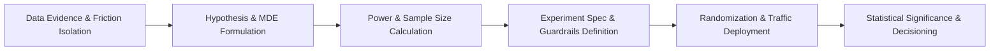

# A/B Experimentation Framework

This document outlines the experimentation methodology, statistical testing protocols, sample size determination standards, and governance rules for designing controlled A/B experiments based on analytical findings.

> **Note:** Actual experiment designs and sample sizing will be populated in Phase 8 after empirical data analysis confirms high-leverage friction areas. No fake experiment results or arbitrary conversion lifts are declared at this stage.

---

## 1. Experimentation Architecture & Governance

Every experiment conducted for ShopSphere must adhere to a standardized experimentation protocol to ensure scientific validity, statistical power, and commercial safety.

---

## 2. Standard Experiment Specification Template

Future A/B tests will be documented using the following standard template:

### 2.1 Metadata & Executive Summary
- **Experiment ID:** `EXP-XXX` (e.g., `EXP-001-MOBILE-AUTOFILL`)
- **Feature Name:** Descriptive title of tested modification.
- **Product Area:** `Cart` / `Address` / `Shipping` / `Payment` / `Global`.
- **Target Audience:** Segment criteria (e.g., All Mobile Web sessions entering Checkout).

### 2.2 Problem Statement & Behavioral Hypothesis
- **Observed Problem:** The specific empirical friction point identified in analytical data.
- **Formal Hypothesis:**
  $$\text{If we } [\text{implement Treatment X}], \text{ then } [\text{Primary Metric Y}] \text{ will increase by } [\text{MDE } \ge Z\%], \text{ because } [\text{behavioral mechanism}].$$

### 2.3 Variant Definitions
- **Control (Variant A):** Existing production flow with no modifications.
- **Treatment (Variant B):** Modified user experience / feature variant.
- *(Optional Treatment Variant C):* Multi-variant variation if testing distinct approaches.

### 2.4 Metric Framework
- **Primary Success Metric:** The single outcome metric deciding the experiment outcome (e.g., `Address Entry Completion Rate` or `Payment Recovery Rate`).
- **Secondary / Diagnostic Metrics:** Intermediate progression metrics explaining *how* the variant worked (e.g., `Address Dwell Time (s)`, `Field Error Rate`).
- **Guardrail / Safety Metrics:** Metrics that must **not** degrade under the treatment (e.g., `AOV`, `Total Revenue per Session`, `Address Correction/Return Rate`, `Gateway Error Rate`).

---

## 3. Statistical Methodology & Sample Size Determination

### 3.1 Randomization Unit
- **Unit of Randomization:** `session_id` (for session-contained checkout modifications) or `customer_id` (for user-level multi-session experiences).
- **Split Ratio:** 50/50 Control vs. Treatment (standard balanced design) or 90/10 phased ramp-up for high-risk checkout changes.

### 3.2 Statistical Parameters
- **Significance Level ($\alpha$):** Standard $\alpha = 0.05$ (corresponding to a 95% Confidence Level). Two-tailed test.
- **Statistical Power ($1 - \beta$):** Standard $1 - \beta = 0.80$ (80% probability of detecting a true effect if present).
- **Minimum Detectable Effect (MDE):** Smallest relative percentage lift the business cares to detect reliably:
  $$n \approx 16 \times \frac{\sigma^2}{\Delta^2} \quad \text{or for binary proportions:} \quad n \approx \frac{2 \cdot (Z_{\alpha/2} + Z_{\beta})^2 \cdot p(1-p)}{(p_B - p_A)^2}$$

### 3.3 Experiment Duration & Seasonality Rules
- **Minimum Duration:** Full 14-day cycle (2 full weekly business cycles) to control for day-of-week seasonality (weekend vs. weekday buying habits).
- **Maximum Duration:** Capped at 28 days to minimize cookie churn, sample contamination, and user drift.
- **Stopping Rule (No Peeking):** Strict prohibition on early stopping based on nominal p-values before predetermined sample size $N$ is reached.

---

## 4. Experiment Decision Matrix

| Statistical Outcome | Guardrail Status | Business Decision |
| :--- | :--- | :--- |
| **Statistically Significant Win** ($p < 0.05, \text{Lift} \ge \text{MDE}$) | Neutral or Positive | **Roll out 100% to Production** |
| **Statistically Significant Win** ($p < 0.05$) | Negative (Guardrail Breached) | **Do Not Ship; Investigate Trade-off / Debug** |
| **Inconclusive / Neutral** ($p \ge 0.05$) | Neutral | **Iterate on Design or Archive; Reallocate Effort** |
| **Statistically Significant Loss** ($p < 0.05, \text{Negative Lift}$) | Any | **Immediate Rollback** |
