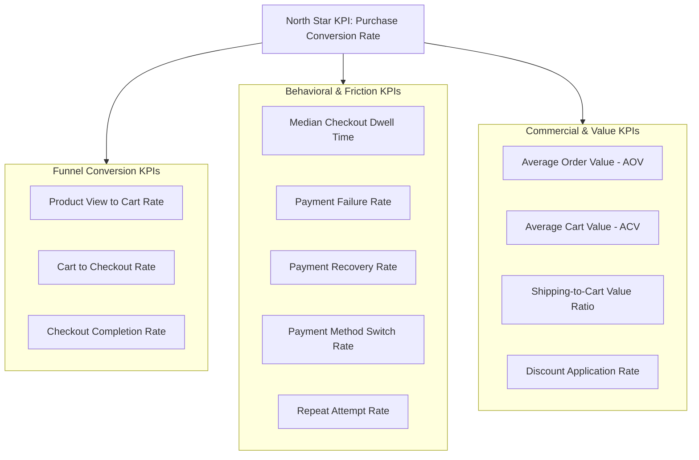

# Product Analytics KPI Framework

This document defines the metric hierarchy, mathematical formulations, operational grains, and analytical pitfalls for all Key Performance Indicators (KPIs) used across the ShopSphere purchase journey analytics case study.

---

## 1. Metric Hierarchy Overview

---

## 2. North Star Outcome Metric

### Purchase Conversion Rate (Overall Session CVR)
- **Definition:** The percentage of all initiated customer sessions that successfully complete an order.
- **Formula:** 
  $$\text{Purchase CVR} = \frac{\text{Count of Sessions with } \texttt{order\_completed}}{\text{Total Count of Initiated Sessions}} \times 100$$
- **Grain:** Session level (`sessions`).
- **Numerator:** Unique `session_id` count where `is_purchased = TRUE`.
- **Denominator:** Total unique `session_id` count.
- **Interpretation:** The primary efficiency index of storefront monetization. Reflects overall site health, audience targeting quality, and journey frictionless.
- **Potential Pitfalls:** Can be skewed by changes in marketing traffic mix (e.g., a surge in low-intent social media traffic depresses CVR even if checkout is performing well).

---

## 3. Funnel Progression KPIs

### 3.1 Product-View-to-Cart Rate (Add-to-Cart Rate)
- **Definition:** The proportion of sessions viewing at least one product page that add at least one item to the shopping cart.
- **Formula:** 
  $$\text{PV-to-Cart Rate} = \frac{\text{Count of Sessions with } \texttt{add\_to\_cart}}{\text{Count of Sessions with } \texttt{product\_view}} \times 100$$
- **Grain:** Session level.
- **Numerator:** Unique `session_id` count with $\ge 1$ `add_to_cart`.
- **Denominator:** Unique `session_id` count with $\ge 1$ `product_view`.
- **Interpretation:** Measures product appeal, pricing competitiveness, and catalog discoverability.
- **Potential Pitfalls:** Does not account for cart quantity or multi-item additions within a single session.

---

### 3.2 Cart-to-Checkout Rate (Checkout Initiation Rate)
- **Definition:** The proportion of sessions that created a cart and proceeded to initiate checkout.
- **Formula:** 
  $$\text{Cart-to-Checkout Rate} = \frac{\text{Count of Sessions with } \texttt{checkout\_start}}{\text{Count of Sessions with } \texttt{add\_to\_cart}} \times 100$$
- **Grain:** Session level.
- **Numerator:** Unique `session_id` count with $\ge 1$ `checkout_start`.
- **Denominator:** Unique `session_id` count with $\ge 1$ `add_to_cart`.
- **Interpretation:** Gauges customer commitment and cart-level friction (e.g., surprise taxes, minimum order thresholds, or coupon hunting).
- **Potential Pitfalls:** Users who use the cart as a "wishlist" or save-for-later tool can artificially depress this metric.

---

### 3.3 Checkout Completion Rate (Checkout Conversion)
- **Definition:** The percentage of sessions that entered checkout and successfully completed the purchase.
- **Formula:** 
  $$\text{Checkout Completion Rate} = \frac{\text{Count of Sessions with } \texttt{order\_completed}}{\text{Count of Sessions with } \texttt{checkout\_start}} \times 100$$
- **Grain:** Checkout session cohort.
- **Numerator:** Unique `session_id` count with `order_completed`.
- **Denominator:** Unique `session_id` count with `checkout_start`.
- **Interpretation:** The definitive diagnostic metric for checkout UX, shipping acceptance, and payment gateway health.
- **Potential Pitfalls:** Masks which specific micro-step (Address, Shipping, or Payment) caused the attrition.

---

## 4. Behavioral & Checkout Friction KPIs

### 4.1 Median Checkout Duration / Dwell Time
- **Definition:** The median time (in seconds) elapsed between `checkout_start` and either `order_completed` or session exit.
- **Formula:** 
  $$\text{Median Dwell Time} = \text{Median}\left( t_{\text{terminal\_checkout}} - t_{\text{checkout\_start}} \right)$$
- **Grain:** Checkout session level.
- **Numerator / Denominator:** Non-parametric 50th percentile of duration distribution.
- **Interpretation:** Measures user cognitive load and form efficiency. Shorter durations generally signify streamlined UX, provided completion rate remains high.
- **Potential Pitfalls:** Mean duration is heavily distorted by extreme right-tail outliers (users leaving tabs open); **Median (p50)** and **IQR** must always be preferred over Mean.

---

### 4.2 Payment Failure Rate
- **Definition:** The percentage of payment authorization attempts that result in an error or decline.
- **Formula:** 
  $$\text{Payment Failure Rate} = \frac{\text{Count of } \texttt{payment\_failed} \text{ events}}{\text{Total Count of } \texttt{payment\_attempt} \text{ events}} \times 100$$
- **Grain:** Payment attempt event level (`events`).
- **Numerator:** Count of `event_type = 'payment_failed'`.
- **Denominator:** Count of `event_type = 'payment_attempt'`.
- **Interpretation:** Primary indicator of payment gateway technical reliability, bank decline frequency, and user payment instrument validity.
- **Potential Pitfalls:** High retries by a small group of persistent users can inflate the event-level failure rate while session-level failure impact is lower.

---

### 4.3 Payment Recovery Rate
- **Definition:** The proportion of checkout sessions experiencing at least one payment failure that subsequently achieve a successful purchase.
- **Formula:** 
  $$\text{Payment Recovery Rate} = \frac{\text{Count of Sessions with } (\ge 1 \ \texttt{payment\_failed} \ \text{AND} \ \texttt{order\_completed})}{\text{Total Count of Sessions with } \ge 1 \ \texttt{payment\_failed}} \times 100$$
- **Grain:** Sessions experiencing payment failure.
- **Numerator:** Failed payment sessions with subsequent `order_completed`.
- **Denominator:** Total sessions recording $\ge 1$ `payment_failed`.
- **Interpretation:** Measures checkout UI resilience and how effectively the application guides users to retry or switch payment methods.
- **Potential Pitfalls:** Fails to distinguish whether recovery was instant (simple OTP retry) or required heavy manual customer intervention.

---

### 4.4 Payment Method Switch Rate
- **Definition:** The percentage of failed payment sessions where the user attempts payment using a different payment method.
- **Formula:** 
  $$\text{Method Switch Rate} = \frac{\text{Count of Sessions with } \ge 2 \text{ distinct payment methods post-failure}}{\text{Total Count of Sessions with } \ge 1 \ \texttt{payment\_failed}} \times 100$$
- **Grain:** Failed payment sessions.
- **Numerator:** Failed payment sessions selecting an alternative payment method.
- **Denominator:** Total sessions recording $\ge 1$ `payment_failed`.
- **Interpretation:** Demonstrates customer willingness to explore alternative payment instruments (e.g., moving from Credit Card to Digital Wallet).
- **Potential Pitfalls:** Requires tracking payment method state transitions across consecutive events.

---

## 5. Commercial & Economic KPIs

### 5.1 Average Order Value (AOV) & Average Cart Value (ACV)
- **Definition:** Average monetary value of converted orders (AOV) and initiated carts (ACV).
- **Formula:** 
  $$\text{AOV} = \frac{\sum \text{final\_cart\_value for converted sessions}}{\text{Count of Converted Sessions}}, \quad \text{ACV} = \frac{\sum \text{cart\_value at cart\_view}}{\text{Count of Cart Sessions}}$$
- **Grain:** Monetary order / cart level.
- **Interpretation:** Assesses monetization depth and cart ticket size.
- **Potential Pitfalls:** High AOV may correlate with lower conversion rates due to increased deliberation friction.

---

### 5.2 Shipping-Cost-to-Cart-Value Ratio (`shipping_ratio`)
- **Definition:** The proportional burden of shipping cost relative to merchandise value.
- **Formula:** 
  $$\text{Shipping Ratio} = \frac{\texttt{shipping\_cost}}{\texttt{cart\_value}}$$
- **Grain:** Checkout session at `shipping_view`.
- **Numerator:** `shipping_cost` presented to user.
- **Denominator:** `cart_value` at shipping stage.
- **Interpretation:** Critical driver of "sticker shock" abandonment. High ratios (>15–20%) are leading indicators of shipping stage drop-off.
- **Potential Pitfalls:** Can be distorted when cart value is very small ($5 item with $5 shipping = 100% ratio).

---

### 5.3 Discount Application Rate & Discount Rejection Rate
- **Definition:** Percentage of carts attempting promo codes, and the proportion of those attempts that fail.
- **Formula:** 
  $$\text{Promo Application Rate} = \frac{\text{Sessions with } \texttt{promo\_applied}}{\text{Sessions with } \texttt{cart\_view}}, \quad \text{Promo Rejection Rate} = \frac{\text{Failed Promo Attempts}}{\text{Total Promo Attempts}}$$
- **Grain:** Cart / Checkout session level.
- **Interpretation:** Monitors coupon-hunting behavior and promotional code UX friction.
- **Potential Pitfalls:** Promo code scrapers and invalid coupons found on external sites can inflate rejection rates.
