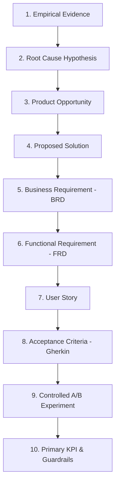

# Product & Business Analyst Improvement Framework

This framework governs how empirical data insights derived from the SQL and Python investigations will be methodically translated into product roadmap opportunities, structured Business Requirement Documents (BRD), Functional Requirement Documents (FRD), agile User Stories with Gherkin Acceptance Criteria, and controlled A/B experiments.

---

## 1. The 10-Step Evidence-to-Impact Translation Chain

To ensure zero disconnect between data analysis and software engineering delivery, every proposed product initiative must trace through this rigorous 10-link chain:



### Chain Step Definitions

1. **Empirical Evidence:** Quantified analytical finding backed by SQL queries, descriptive statistics, or behavioral segmentation (e.g., *"Mobile users exhibit a 42% drop-off at Address Entry with a median dwell time 2.1× higher than desktop"*).
2. **Root Cause Hypothesis:** Structural or UX explanation for why the friction exists (e.g., *"Mobile address form contains 9 mandatory input fields without native OS autofill or Google Places API integration"*).
3. **Product Opportunity:** High-level strategic opening to eliminate friction and unlock revenue.
4. **Proposed Solution:** Concrete feature concept or workflow redesign (e.g., *"Implement 1-tap Google Places Address Autocomplete and Express Guest Checkout"*).
5. **Business Requirement (BRD):** Strategic business goal, scope, stakeholder impact, and expected commercial ROI.
6. **Functional Requirement (FRD):** Exact system capabilities, data validation logic, API payload contracts, error-handling states, and edge cases.
7. **User Story:** Agile narrative written from the customer persona's perspective (`As a... I want to... So that...`).
8. **Acceptance Criteria (Gherkin format):** Binary testable conditions written in `Given... When... Then...` syntax for engineering implementation and QA verification.
9. **Controlled A/B Experiment:** Formal test plan specifying control vs. variant, target traffic allocation, and sample size.
10. **Primary KPI & Guardrails:** Quantifiable success metric paired with safety guardrails (e.g., Primary: `Address Completion Rate`, Guardrail: `Address Error / Return Rate`).

---

## 2. Product Opportunity Prioritization: RICE Framework

Identified opportunities will be objectively prioritized using the **RICE** scoring model to determine development sequencing:

$$\text{RICE Score} = \frac{\text{Reach} \times \text{Impact} \times \text{Confidence}}{\text{Effort}}$$

### Scoring Components:
- **Reach:** Estimated number of affected sessions or users per quarter.
  - Calculated directly from SQL funnel volume queries.
- **Impact:** Expected lift on the target stage conversion rate.
  - Scale: `3` (Massive), `2` (High), `1` (Medium), `0.5` (Low), `0.25` (Minimal).
- **Confidence:** Analytical certainty based on data quality, statistical significance, and user behavioral clarity.
  - Scale: `100%` (High data evidence + benchmark validation), `80%` (Medium data evidence), `50%` (Low evidence/exploratory).
- **Effort:** Estimated engineering person-weeks / sprints required for implementation.
  - Scale: `1` (1-2 sprints / low complexity) to `5` (multi-quarter architectural overhaul).

---

## 3. Product Specification Templates (For Future Phases)

### 3.1 Business Requirement Specification (BRD Snippet)
```markdown
### BRD: [Feature Name]
- **Problem Statement:** [Data-backed friction description]
- **Business Objective:** [Commercial outcome & conversion lift target]
- **Target Audience / Cohort:** [Mobile users / First-time buyers / Failed payment sessions]
- **In-Scope Capabilities:** [List of core functional changes]
- **Out-of-Scope:** [Explicit boundaries]
```

### 3.2 User Story & Gherkin Acceptance Criteria Template
```markdown
### User Story: [Title]
**As a** [customer persona / e.g., first-time mobile shopper],
**I want to** [action / e.g., select my address from an automated dropdown],
**So that** [benefit / e.g., I can complete shipping details quickly without repetitive mobile typing].

#### Scenario 1: Successful Address Selection via Autocomplete
- **Given** the user is on the mobile checkout shipping address form,
- **When** the user types at least 3 characters into the street address field,
- **Then** the system displays a list of matching verified addresses,
- **And** selecting an address automatically populates City, State, and Postal Code fields.

#### Scenario 2: Network Timeout / Fallback to Manual Entry
- **Given** the address verification API experiences a latency timeout (>3000ms),
- **When** the user continues typing,
- **Then** the form seamlessly allows manual text entry without blocking or error alerts.
```

---

## 4. Governance Rule
No product requirement or user story will be authored until the completion of Phase 4 (SQL Investigation) and Phase 5 (Python Behavioral Analysis), ensuring every requirement is directly anchored in verified data patterns.
